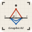

<div align="center">



# **GraphicAI**

*A drafting machine for engineering students.*

Type the problem in plain English.  
Receive a first-angle projection plate — drafted, dimensioned, ready to copy onto sheet.

[](https://nextjs.org)
[](https://www.typescriptlang.org)
[](https://tailwindcss.com)
[](https://ai.google.dev)
[](#license)

— From a student, to students. **Arsh Pathan.**

</div>

---

## The problem

Engineering Graphics is a beautiful subject taught with a brutal workflow.
You read a prose problem — *"a hexagonal lamina of side 25 mm rests on a corner
on HP, plane at 45° to HP, diagonal at 30° to VP"* — then spend forty-five
minutes computing apparent angles, drawing three stages on A2, erasing the
ones that ran off the sheet, and starting over when your TV doesn't line up
with your FV.

The maths is short. The drafting is long. The looping between them is
exhausting.

## The fix

GraphicAI reads your problem, computes the rotation matrices, derives the
apparent angle β = arctan(tan θ / cos φ) when both inclinations are given,
lays out all three stages — *True Shape → HP Inclination → VP Inclination* —
on a single canvas, and labels every vertex `a, b, c…` with primed copies
`a', b', c'…` in the front view. The output is a **single self-contained
HTML file** you can open offline, screenshot for your assignment, or trace.

It is opinionated about first-angle convention (VP above XY, HP below) and
about colour: **FV in crimson, TV in blueprint blue, projectors muted grey**.
Your professor will recognise it.

---

## Quick start

```bash
git clone https://github.com/Arsh-Pathan/GraphicAI.git
cd GraphicAI
npm install
cp .env.example .env       # then paste your Gemini key into .env
npm run dev
```

Open [http://localhost:3000](http://localhost:3000) and head to **The Studio**.

### Getting a Gemini API key (30 seconds)

1. Visit **[aistudio.google.com/app/apikey](https://aistudio.google.com/app/apikey)**
2. Sign in with any Google account.
3. Click **Create API key**. Google mints a key beginning with `AIza…`.
4. Paste it into `.env` as `GEMINI_API_KEY=AIza…`.

The free tier on Gemini 2.5 Flash gives you **15 RPM and 1,500 requests/day**
— plenty for a semester of plates.

---

## Bring Your Own Key (BYOK)

You don't *have* to provision a server-side key. If the shared key hits its
quota — or you're hosting GraphicAI for a study group and don't want to pay
for everyone's drafts — the `/generate` UI degrades gracefully:

1. The API route returns a structured `{ code: "RATE_LIMITED", needsUserKey: true }`.
2. A drafted modal appears with a 4-step Google AI Studio walkthrough.
3. The user pastes their key. It's stored in **`localStorage` only** —
   never on the server, never logged, never shared.
4. Subsequent requests carry it in a `x-gemini-key` header. The route prefers
   the user key over the server key when both exist.
5. One click clears the saved key.

```ts
// src/app/api/generate/route.ts (excerpt)
const userKey = req.headers.get("x-gemini-key")?.trim();
const apiKey  = userKey || process.env.GEMINI_API_KEY;
```

---

## How it works

```
┌────────────────┐    prose      ┌──────────────────────┐
│  The Studio    │  ──────────▶  │  /api/generate       │
│  (Next.js UI)  │               │  • system instruction│
└────────────────┘               │  • canonical exemplar│
        ▲                        │  • Gemini 2.5 Pro    │
        │                        └─────────┬────────────┘
        │   single-file HTML               │
        │                                  ▼
        │                        ┌──────────────────────┐
        │                        │  Gemini computes     │
        │                        │  vertex array,       │
        │                        │  rotation matrices,  │
        │                        │  apparent β,         │
        │                        │  layout, projectors  │
        │                        └─────────┬────────────┘
        │                                  │
        └──────────────── sandboxed iframe ┘
```

### The system prompt

The prompt baked into `route.ts` is not a polite nudge — it's a drafting
manual. It enforces:

- First-angle convention (VP above XY, HP below).
- Colour: FV `#e53e3e`, TV `#3182ce`, projectors `#a0aec0`.
- Vertex labelling: `a` for TV, `a'` for FV; primed labels never overlap edges.
- Three stages, left-to-right, with a 120px gutter.
- Apparent-angle formula when both inclinations are given.
- A self-check pass before emitting closing `</html>`.

If Gemini returns a malformed response (no `<!DOCTYPE html>`), the route
flags `BAD_OUTPUT` and asks the user to rephrase.

### The exemplar

`src/lib/exampleHtml.ts` is a working 8-problem solver — written by hand —
shipped as a string. It's the few-shot reference that anchors every
generation. Editing it changes what every future plate looks like; that's
deliberate.

---

## What it can solve (today)

The exemplar covers the eight canonical lamina problems:

|   | Lamina               | Resting | Constraints                              |
|---|----------------------|---------|------------------------------------------|
| 1 | Square plate         | Corner  | One diagonal twice the other            |
| 2 | Rhombus / square     | Corner  | TV diagonals 60 × 40                    |
| 3 | Isosceles triangle   | Apex    | Opposite side 50mm above HP, 30° to VP  |
| 4 | Equilateral triangle | Corner  | Surface 60° to HP, opposite edge 30° VP |
| 5 | Pentagonal lamina    | Corner  | 60° to HP, opposite edge 45° to VP      |
| 6 | Rectangular plane    | Edge    | TV appears as square                    |
| 7 | Hexagonal lamina     | Corner  | 45° to HP, diagonal 30° to VP           |
| 8 | Circular lamina      | Edge    | Diameter 30° to VP, 45° to HP           |

Gemini extends from these by analogy — most plane-figure projection problems
work. Solids (prisms, pyramids, cones, frustums) are next on the bench.

---

## Aesthetic

The interface is deliberately **not** Stripe-flavoured. It is bone paper
(`#f1ece2`), graphite ink (`#1a1816`), with sanguine red (`#b8341c`) and
blueprint blue (`#1e5fa8`) as the only accents. Type is **Fraunces** (a
flared, optical-sized serif), **JetBrains Mono**, and **Inter** for body.

There are no purple gradients. There are corner ticks, dimension lines,
ruler-tick rules, and a title-block strip at the top of every plate. If
your professor squinted, they might mistake it for a printed studio sheet.

---

## Stack

| Layer       | Choice                                            |
| ----------- | ------------------------------------------------- |
| Framework   | Next.js 16 (App Router, Turbopack, `output: standalone`) |
| Language    | TypeScript 5                                      |
| Styling     | Tailwind CSS v4 + a hand-written drafting system  |
| Motion      | Framer Motion 12                                  |
| Fonts       | Fraunces · JetBrains Mono · Inter (via `next/font`) |
| AI          | Google Gemini 2.5 Pro / 2.5 Flash (`@google/genai`) |
| Container   | Multi-stage Dockerfile + docker-compose w/ healthcheck |

---

## Docker

```bash
docker compose up -d --build
```

The compose file loads `.env`, exposes `:3000`, runs a wget healthcheck
every 30s, and rotates logs (`max-size: 10m`, `max-file: 3`). Tear down with
`docker compose down`.

---

## Project layout

```
src/
├── app/
│   ├── api/generate/route.ts   ← Gemini route, BYOK, error codes
│   ├── generate/page.tsx        ← The Studio (composer + preview + key panel)
│   ├── page.tsx                 ← Landing folio
│   ├── layout.tsx               ← Fraunces / JetBrains / Inter + metadata
│   ├── globals.css              ← Drafting design system (palette, ruler, grain)
│   └── icon.svg                 ← Next.js auto-favicon
└── lib/
    └── exampleHtml.ts           ← The canonical 8-problem exemplar

public/
├── graphicai-mark.svg           ← Full wordmark (OG image)
└── graphicai-icon.svg           ← Pure mark (favicon, app icon)
```

---

## Roadmap

- [ ] Solids: prisms, pyramids, cones, cylinders, frustums.
- [ ] Section views with cutting planes.
- [ ] Isometric companion view rendered alongside the orthographic plate.
- [ ] DXF / SVG export (not just HTML).
- [ ] An `/explainer` page that walks through how the matrices were derived.
- [ ] A library of solved precedents, browseable on the landing folio.

PRs, issues, and rude corrections from your Engineering Drawing teacher
are all welcome.

---

## License

MIT.

## Credit

Built by **Arsh Pathan** — *from a student, to students.*

If GraphicAI saved you a night of erasing, ⭐ the repo. That's the receipt.
